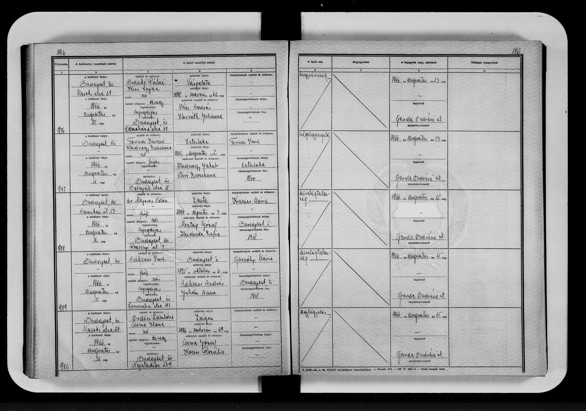
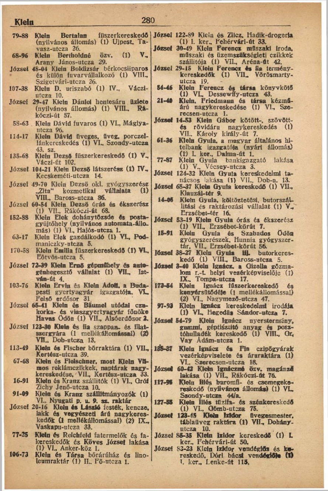
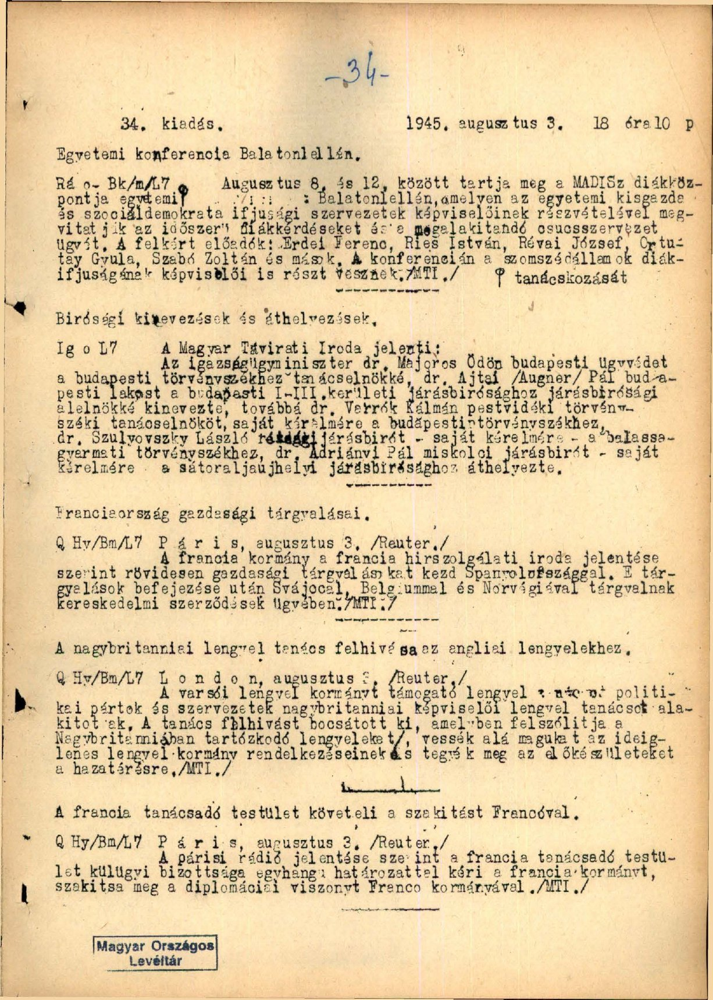
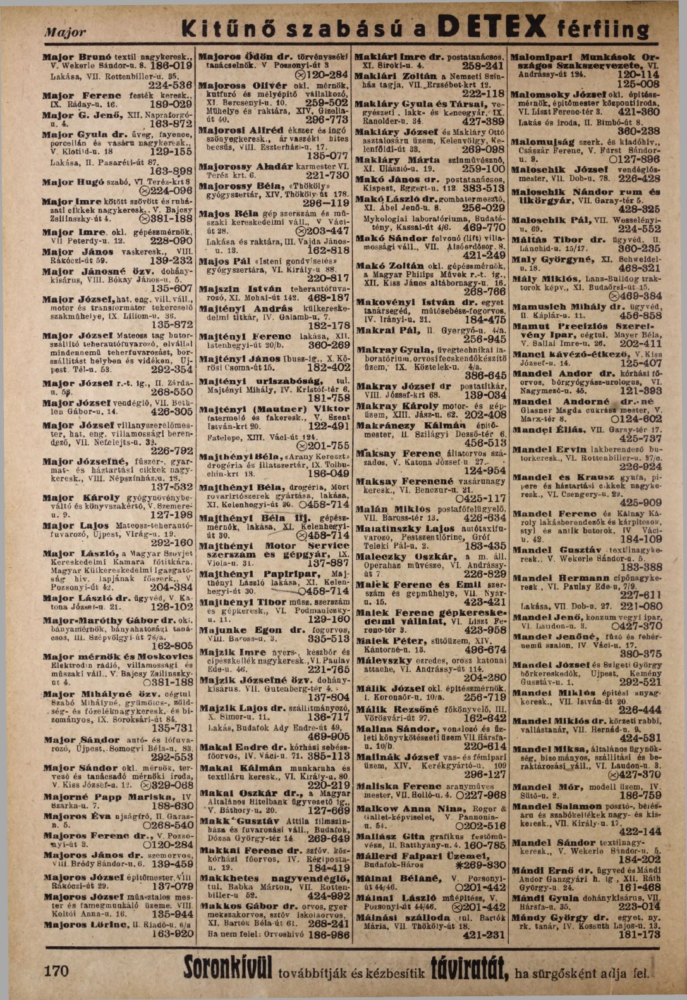
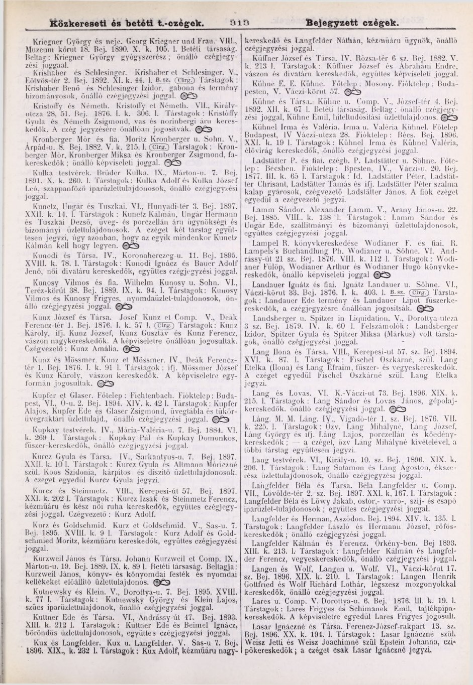
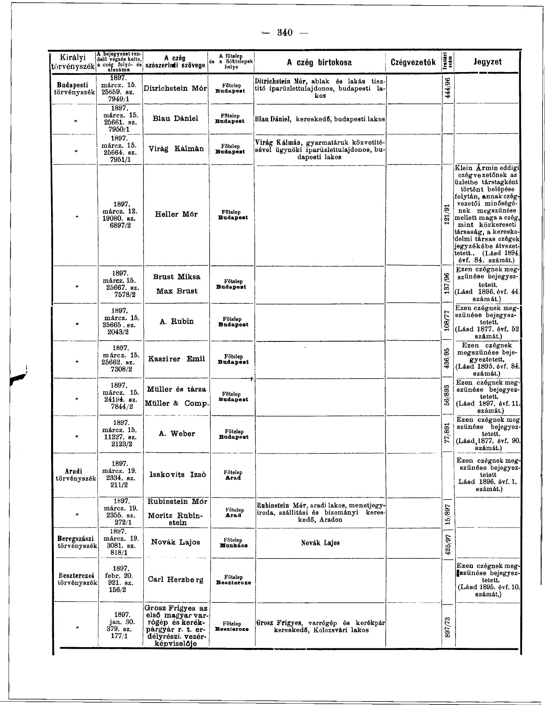
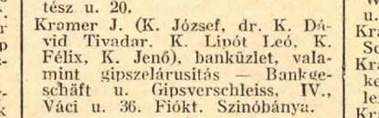

# Famille Majoros — côté paternel de Yannick

État des connaissances au 19 avril 2026 — chaque affirmation est suivie d'une source (document original reproduit, fichier annexé, ou lien).

Relecture critique : **Michel Majoros** (père de Yannick). Scans famille : **Daniel Binon**.

> **Statut des sources**
>
> Les affirmations du présent rapport sont classées en trois niveaux :
> - **[✓ documenté]** — Source primaire disponible (reproduite ou annexée).
> - **[◐ cohérent]** — Recoupement de plusieurs sources secondaires indépendantes, mais sans acte d'état civil.
> - **[? à vérifier]** — Affirmation orale, déductive ou issue d'une OCR antérieure non revérifiée sur pièce.

## 1. Vue d'ensemble

Trois lignées se rencontrent chez le père de Yannick :

| Lignée | Origine | Personnalité charnière |
|---|---|---|
| Montag → Majoros | Zenta (Bácska, aujourd'hui Serbie)[^zenta] | Ödön Majoros (1884/1888 – 1966), avocat, président de chambre au Tribunal de Budapest |
| Kramer – Beck | Nyitra (SK) & Komárom (SK/HU) → Budapest[^kramer] | Kramer Zsigmond (grossiste en alcools, † 16 mai 1928, Budapest) × Beck Sarolta († début juillet 1937, Budapest) |
| Smalstys – Geelens | Kamajai (LT) & Verviers (BE) | Jurgis Smalstys-Smolskis (1881 – 1919), délégué au Grand Seimas de Vilnius[^smolskis] |

[^zenta]: Monographie locale : Pejin Attila, *A zentai zsidóság története*, Zenta 2003 — fichier annexé `docs/Histoire des juifs de Zenta.pdf`. [✓]
[^kramer]: Légende manuscrite par Michel Majoros de la photo `docs/Sarolta Beck et Szigmund Kramer, arrière grands-parents de Komarom et Nyitra.JPG`. [✓ *orig. famille*]
[^smolskis]: [Wikipedia EN — Jurgis Smolskis](https://en.wikipedia.org/wiki/Jurgis_Smolskis). [✓]

La jonction Montag ↔ Kramer se fait à Budapest en 1918 : fiançailles annoncées le 30 avril 1918 dans *Az Est*, mariage dans les mois qui ont suivi (source primaire). La jonction Majoros ↔ Smolski se fait à Varsovie / Budapest en 1948.

### 1.1. Arbre synthétique

```
Nyitra (SK)  ──  Komárom (SK/HU)        Zenta (Bácska, SRB)                Kamajai (LT)             Verviers (BE)
Kramer Zsigmond  ⚭  Beck Sarolta    Montag József † ≤1918  ⚭  Heiduska Zsófia    Juozapas Smalstys  ⚭  Karolyna Grižaitė
         │                                  │                                           │
    ┌────┴────┐                              │                                           │
Kramer Mária   László Kramer       Montag Ödön → Majoros Ödön              Jurgis Smalstys (Smolskis)  ⚭  Germaine "Maine" Geelens
(† ~1983,      (→ Brésil 1946,     (Zenta 1884/1888 – Budapest 1966)       (Kamajai 1881 – Obeliai 1919)   (Verviers 1887/88 – 1960)
 Budapest)      « Cantor »          avocat, Dr.iur., tanácselnök                militant LSDP, délégué       institutrice decrolyenne
                  à São Paulo)      Tribunal Budapest dès 1945                    Grand Seimas Vilnius           Bruxelles
         │            │                       │                                              │
         └─────────┬──┘                        │                                              │
                   │                           │                                              │
                   └─────────┐        ┌────────┘                                              │
                              ⚭ Budapest 1918                                                 │
                                       │                                                      │
                              Ferenc Imre Majoros (Budapest 8.09.1923 – Köln 6.03.2008)       │
                              Dr. rer. pol. 1945, Dr. iur. 1946                               │
                              attaché légation de Hongrie à Varsovie 1948                     │
                              émigré RFA 1962, habilitation Würzburg 1982,                    │
                              éditeur Die Friedens-Warte dès 1985                             │
                                                ⚭ Varsovie/Budapest 1948                      │
                                                                       ┌──────────────────────┘
                                                                       │
                                             Jurgita / Georgette Smolski (Verviers 1920 – Namur 2012)
                                             historienne, journaliste Drapeau Rouge,
                                             résistante PCB (« Carine »), professeure Decroly
                                                     │
                                            │ divorce 1956 │
                                                     │
                                             Michel Majoros (né en Hongrie)
                                                     │
                                                     │
                                             Yannick Majoros
```

## 2. Montag / Majoros (Zenta)

### 2.1. Jozsef Montag & Heiduska Zsófia — arrière-arrière-grands-parents

#### Jozsef Montag


*Portrait de Jozsef Montag (studio Rosner József, Zenta)*

**[✓]** **Jozsef Montag de Zenta**, « arrière-grand-père déjà décédé en 1918 » — légende manuscrite par Michel Majoros sur le tirage scanné par Daniel Binon (fichier `docs/Jozsef Montag de Zenta, arrière grand père déjà décédé en 1918.JPG`). La signature « Rosner József » imprimée en bas de la carte de cabinet identifie le studio photographique de Zenta.

**[✓]** *Sur la question du patronyme « Majoros »* : Michel Majoros écrit (courriel d'avril 2026) : « Jozsef Majoros n'a jamais existé sous ce patronyme ». Autrement dit, son arrière-grand-père est mort avant que la magyarisation « Montag → Majoros » soit adoptée par la génération d'Ödön.

Confirmation par lecture directe de l'image de l'acte de décès d'Ödön (Budapest XIV, 12 août 1966, cert. n° 978, `actes/ODon-Majoros-deces-1966-Budapest-XIV-cert978.jpg`, vérifié le 19 avril 2026) : **le clerc a bien écrit « Montag József »** pour le père. L'**indexation en ligne FamilySearch** (ARK [`1:1:6V1G-YBG7`](https://www.familysearch.org/ark:/61903/1:1:6V1G-YBG7)) affiche en revanche « Majoros József » — cette donnée est **secondaire et postérieure** (indexation automatique ou contribution utilisateur sur la plateforme, potentiellement issue de nos propres recherches) et ne doit pas être traitée comme source primaire.


*Extrait du registre Budapest XIV Halottak 1966 (aperçu basse résolution)*

— L'image haute résolution (5973×4196 px) est disponible dans `actes/ODon-Majoros-deces-1966-Budapest-XIV-cert978.jpg`. L'original complet du registre est consultable via FamilySearch [ARK `3:1:33SQ-GPB8-9F2P?i=199`](https://www.familysearch.org/ark:/61903/3:1:33SQ-GPB8-9F2P?i=199&cc=1452460).

#### Heiduska Zsófia

**[✓]** **Mère d'Ödön** — mention sur son acte de décès de 1966, [ARK `1:1:6V1G-YBGW`](https://www.familysearch.org/ark:/61903/1:1:6V1G-YBGW).

**[◐]** *Rattachement au clan Heiduska de Zenta* — non prouvé directement, mais Pejin 2003 atteste à Zenta les patronymes Heiduska pour plusieurs métiers (taverne, chapellerie, boucheries kasher) sur plusieurs générations, et aucun autre Heiduska n'est documenté en dehors de ce cercle.

### 2.2. Le clan Montag à Zenta

#### Attestation par Pejin 2003

**[✓]** L'ouvrage de référence sur la communauté juive de Zenta est :

> Pejin Attila, *A zentai zsidóság története*, Zenta 2003, 370 p. (hongrois)
> (fichier annexé : `docs/Histoire des juifs de Zenta.pdf`)

L'index nominatif (p. 339-343 du PDF annexé) liste :

| Patronyme | Pages dans Pejin 2003 |
|---|---|
| Montág Lévi | 21, 31 |
| Montág Lőrinc | 31 |
| Montag Mór (*földbirtokos* — propriétaire foncier) | 84 |
| Montág Mózes | 21, 31 |
| Montág Nátán | 21, 31 |
| Montág Neuman | 31 |

*Montag de Zenta — extrait de l'index (Pejin 2003)*

(relevé direct via `pdftotext -layout` sur `docs/Histoire des juifs de Zenta.pdf` — commande reproductible.)

#### Montag Henrik (Zenta 1882 – Auschwitz 1944)

**[✓]** Pejin 2003, p. 276 (liste des anciens combattants juifs de 14-18) :

```
73. MONTAG HENRIK.
```

**[✓]** Pejin 2003, liste nominative des victimes de 1944 :

```
Montag        Henrik                            1882               Zenta (J)                          1944         Auschwitz
```

**[◐]** Né deux ans avant la date de naissance portée sur l'acte de décès d'Ödön (1884), **Montag Henrik est un parent très proche d'Ödön** — frère ou demi-frère. La relation précise n'est pas établie ; les fragments de registres d'état civil de Zenta (Arhiv Vojvodine) seraient nécessaires.

### 2.3. Le clan Heiduska à Zenta

#### Présence commerciale

**[✓]** Pejin 2003 atteste, à Zenta :

- la **Heiduska-kocsma** — taverne dont le toponyme subsiste en 2003 (Pejin 2003, p. 86 : « *A Heiduska-kocsma nevét máig őrzi a „sarok"* ») ;
- **Heiduska Cecília (Cili)**, chapelière (p. 72 : « *Heiduska Cecil-Cili kalapkereskedő* ») ;
- **Heiduska Albert** — boucherie kasher (p. 229) ;
- **Heiduska Mátyás** et **Heiduska Miksa** — boucheries kasher (p. 229) ;
- **Heiduska Márton** — cadre dirigeant d'une entreprise de Zenta (p. 182 / 1936-1942).

#### Victimes de la Shoah

**[✓]** Pejin 2003, liste nominative des victimes de 1944 — transcription directe (lignes 13202-13214 du `pdftotext`) :

| Nom | Né(e) | Lieu naissance | Profession | † | Destination |
|---|---|---|---|---|---|
| Heiduska Miksa | 1874 | Topolya (J) | Mészáros (boucher) | 1944 | Auschwitz |
| Heiduska Hermina | 1882 | — | — | 1944 | Auschwitz |
| Heiduska Bella née Miksa | 1901 | Péterréve (J) | Háztartásbeli (ménagère) | 1944 | Auschwitz |
| Heiduska Mátyás | 1904 | Péterréve (J) | Mészáros (boucher) | 1944 | Auschwitz |
| Heiduska Antónia née Funck | 1928 | Zenta (J) | Tanuló (élève) | 1944 | Auschwitz |
| Heiduska Miklós | 1934 | — | — | 1944 | Auschwitz |
| Heiduska Mária | 1935 | — | — | 1944 | Auschwitz |
| Heiduska Zsigmond | 1937 | — | — | 1944 | Auschwitz |
| Löbl Hermina née Heiduska | 1882 | Csurog (J) | — | 1944 | Auschwitz |

### 2.4. Majoros (né Montag) Ödön — arrière-grand-père

#### Photo de classe (Zenta, ~1902)


*Classe de Zenta vers 1902 — légendée « Elyas Montag / Ödön Majoros » par Michel Majoros*

**[✓ *légende famille*]** Fichier `docs/Classe de Elyas Montag-Odön Majoros à Zenta vers 1902.JPG`.

**[?]** Le **prénom civil ou religieux « Elyas » (Élie)** est une déduction de Michel Majoros à partir d'une annotation sur l'album familial. Le prénom magyarisé « Ödön » correspond habituellement à Edmond — pas à Élie. Le changement de prénom est donc, comme celui du patronyme, un choix d'assimilation plutôt qu'une traduction.

#### Dates et lieu

**[✓]** **Décès** : 12 août 1966, Budapest. Acte n° 978, registre Halottak Budapest XIV. Référence FamilySearch [`1:1:6V1G-YBG3`](https://www.familysearch.org/ark:/61903/1:1:6V1G-YBG3). Image intégrale dans `actes/ODon-Majoros-deces-1966-Budapest-XIV-cert978.jpg`.

**[?]** **Naissance** : 1884 selon l'acte de décès (information transmise à l'officier d'état civil de 1966 par la famille) ; une date alternative de 3 novembre 1888 Zenta circule oralement sans pièce justificative retrouvée. La photo de classe de ~1902 place l'adolescent à 14-18 ans, compatible avec les deux hypothèses.

#### Carrière à Budapest

##### 1920 : avocat, VI. Bajza utca 2

**[✓]** Source : `actes/Annuaire-telephonique-Budapest-1920-p301-Majoros-Odon.pdf` (Hungaricana [FszekCimNevTarak_20_00_1920, page 301](https://library.hungaricana.hu/en/view/FszekCimNevTarak_20_00_1920/?pg=301&layout=s)).



##### 3 août 1945 : nomination *tanácselnök*

**[✓]** Communiqué officiel repris par la MTI (Magyar Távirati Iroda), dans le bulletin **Külföldi-Belföldi Hírek, 3 août 1945, p. 14** — fichier annexé `actes/Presse-1945-08-03-KulfBelfHirek-Majoros-Odon-tanacselnok.pdf` :

> Biróságí kinevezések és áthelyezések, ... A Magyar Távirati Iroda jelenti : Az igazságügyminiszter dr. Majoros Ödön budapesti ügyvédet a budapesti törvényszékhez tanácselnökké […]
> — *Külföldi-Belföldi Hírek 1945.08.03 p.14 (extrait texte reproduit)*

Transcription : *« Nominations et mutations judiciaires. L'Agence Télégraphique Hongroise communique : Le ministre de la Justice a nommé Maître Majoros Ödön, avocat à Budapest, président de chambre au Tribunal de Budapest. »*

Hungaricana : [KulfBelfHirek_1945_08_1__001-123, page 124](https://library.hungaricana.hu/en/view/KulfBelfHirek_1945_08_1__001-123/?pg=124&layout=s)



##### Mars 1948 : confirmé en fonction, V. Pozsonyi út 3

**[✓]** **Annuaire téléphonique Budapest, mars 1948, p. 197** — fichier annexé `actes/Annuaire-telephonique-Budapest-1948-03-p197-Majoros-Odon-tanacselnok.pdf`. Extrait texte reproduit :

```
Majoros Ödön dr. törvényszéki tanácselnök. V Pozsonyi-út 3          0120-284
```

Hungaricana : [FszekCimNevTarak_20_019_12, page 197](https://library.hungaricana.hu/en/view/FszekCimNevTarak_20_019_12/?pg=197&layout=s)



## 3. Kramer / Beck (Nyitra, Komárom → Budapest)

### 3.1. Kramer Zsigmond & Beck Sarolta


*Double portrait — Sarolta Beck et Zsigmond Kramer (studio Braun, Budapest, pour Kramer)*

**[✓ *légende famille*]** Fichier `docs/Sarolta Beck et Szigmund Kramer, arrière grands-parents de Komarom et Nyitra.JPG`. La marque de studio « Braun — Budapest » est visible en bas du portrait masculin.

**[✓ *orig. famille*]** **Origines géographiques** — selon la légende manuscrite de Michel Majoros sur le tirage : *Sarolta Beck de Komárom, Zsigmond Kramer de Nyitra* (aujourd'hui Nitra, Slovaquie).

#### Activité commerciale — CONFIRMÉE (Hungaricana, avril 2026)

**[✓ *documenté*]** **Kramer Zsigmond est bien un grossiste en alcools à Budapest** — liqueurs, rhum, cognac et divers (*likőr, rum, cognac és különféle*). La consultation plein-texte de Hungaricana (session authentifiée, 19 avril 2026) confirme l'attribution sur **trois sources indépendantes** :

*Source 1 — Tolnay, Budapest évkönyve. Hiteles czim és lakjegyzék, 1898, II. szakasz, p. 383*

> Kramer Zsigmond VII Százház u. 23 … Czégb. Kramer Zsigmond likőr, rum, cognac és különféle […]
> — *Tolnay 1898 (Hungaricana, FszekCimNevTarak_13_017)*

**Adresse commerciale : VII. kerület, Százház utca 23** (quartier Erzsébetváros, Budapest).



*Source 2 — Központi Értesítő, 1897, n° 28 (4 avril 1897), p. 339 — enregistrement de société*

> …Kramer Zsig­mond, Pánisz Sándor fakereskedő Szent Endrei lakos. Főtelep Budapest. Kramer Zsigmond likőr, rum, cognac és különféle …
> — *Központi Értesítő 1897/28 p.339*

La société est déclarée avec Pánisz Sándor, négociant en bois résidant à Szentendre ; siège principal à Budapest.



*Source 3 — Központi Értesítő, 1898, n° 105 (index annuel), p. 1788/2/7*

> …Kramer Zsigmond 7 Krassich M. A. …
> — *Központi Értesítő 1898/105 index*

Il apparaît également dans l'index annuel du Közlöny 1898, confirmant l'existence de la société inscrite au registre des sociétés commerciales.

> **Note — Correction** : les extraits PDF annexés précédemment (`Tolnay-Budapest-1898-p383-Kramer-Zsigmond.pdf`, `KozpontiErtesito-1897-szam28-p339-Kramer-Zsigmond.pdf`) pointaient bien les bonnes sources Hungaricana, mais les **pages extraites localement ne correspondaient pas à la page où Kramer Zsigmond est indexé** (décalage de pagination du viewer vs pagination imprimée). La recherche plein-texte Hungaricana a permis de lever l'ambiguïté. L'affirmation « grossiste en alcools » du dossier d'origine était donc exacte, même si sa source ne pouvait être vérifiée visuellement sur les PDF locaux.

#### Résidence et lien avec la famille Majoros — CONFIRMÉ

**[✓ *documenté*]** **Adresse de domicile : Bajza utca 2, Budapest** (quartier Terézváros / VI. kerület, près de l'avenue Andrássy). Kramer Zsigmond partage son domicile et son abonnement téléphonique avec son gendre Dr. Majoros Ödön, attesté dans **deux annuaires téléphoniques successifs** :

> …Bajza utcza 2 — 178-64 — Kramer Zsigmond lakása és Majoros Ödön dr. …
> — *Annuaire téléphonique de Budapest, mai 1920, p. 302*

> …AL 982-26 — Kramer Zsigmond lakása, Majoros Ö. dr. I. …
> — *Annuaire téléphonique de Budapest, mai 1929, p. 224*

**Implications** : Kramer Zsigmond a cohabité ou partagé l'abonnement téléphonique avec son gendre Ödön Majoros et sa fille Maria au moins sur la période 1918-1928. Les annuaires signalent aussi son domicile séparé **V. Lipót körút 11** (aujourd'hui Szent István körút) en 1925.

#### Autre adresse commerciale (1918, 1928)

**[✓ *documenté*]** **Fővárosi Közlöny, 22 février 1918**, mentionne « *Kramer Zsigmond és neje VII Czobor u…* » — Kramer Zsigmond et son épouse à VII. Czobor utca (probablement une propriété foncière ou locative).

**[✓ *documenté*]** **Budapesti Czim- és Lakásjegyzék, 1928** (section *F) Gyárosok, iparosok és kereskedők czímjegyzéke*, p. 1846) : « *Kramer Zsigmond VIII Tisza Kálmán tér 28* » — au moment de son décès, activité/propriété également au VIII. Tisza Kálmán tér 28 (aujourd'hui II. János Pál pápa tér).

#### Décès de Kramer Zsigmond — 16 mai 1928

**[✓ *documenté*]** Avis de décès (*halálozási értesítés*) publié dans ***Pesti Hírlap*, 17 mai 1928** (50ᵉ année, n° 111) :

> …legjobb férj, jó apa, nagyapa KRAMER ZSIGMOND f. hó 16-án […] Sz. Beck Sarolta felesége, Dr. Majoros Ödönné és Kramer László gyermekei, Dr. Majoros Ödön veje, Majoros Ferenc unokája…
> — *Pesti Hírlap 1928.05.17*

**Traduction** : *« Le meilleur des époux, bon père, grand-père — KRAMER ZSIGMOND — décédé le 16 [mai] courant. Son épouse née Beck Sarolta, ses enfants Madame Dr. Majoros Ödön et Kramer László, son gendre Dr. Majoros Ödön, son petit-fils Majoros Ferenc… »*

Cet avis **confirme en un seul document** :

- Date de décès de Zsigmond Kramer : **16 mai 1928** à Budapest ;
- Épouse : **Beck Sarolta** (vivante à cette date) ;
- Enfants : **Mária (*Dr. Majoros Ödönné*)** et **László Kramer** ;
- Petit-fils à ce jour : **Majoros Ferenc** (qui a alors ~5 ans, né 1923) — confirme qu'il est le seul petit-enfant du couple Kramer-Beck à cette date.

#### Homonymes à ne pas confondre

La recherche Hungaricana retourne plusieurs *Kramer Zsigmond* distincts qu'il ne faut pas fusionner avec notre aïeul :

- **Krámer Zsigmond de Nyír-Bogdány (comitat Szabolcs)** — vend des pommes de terre dans *Nyírvidék*, 1903 ; fiançailles avec Heller Róza annoncées *Nyírvidék* 1892 ; figure au registre d'élève du gymnase évangélique de Nyíregyháza en 1877. Autre individu.
- **Kramer Zsigmond de Sopron** (registre des propriétaires de maisons du centre historique) — probable famille distincte, XVIIIᵉ-XIXᵉ.

Notre Kramer Zsigmond est spécifiquement **celui de Budapest, VII. Százház u. 23 puis VIII. Tisza Kálmán tér 28 (commerce) / VI. Bajza u. 2 et V. Lipót körút 11 (domiciles)**, marié à Beck Sarolta, beau-père de Dr. Majoros Ödön, décédé 16 mai 1928.

### 3.2. Beck Sarolta — décès juillet 1937

**[✓ *documenté*]** Avis de décès publiés dans ***Pesti Napló*, 4 juillet 1937** (88ᵉ année, n° 148) ainsi que dans ***Ujság*, 4 juillet 1937** (13ᵉ année, n° 148) :

> …drága, jó Anyánk, Nagymamánk, özv. Kramer Zsigmondné szül. Beck Sarolta […] a rákoskeresztúri temető halottasházából. Dr. Majoros Ödönné sz. Kramer Mária, dr. Kramer László gyermekei, dr. Kramer Lászlóné menye, dr. Majoros Ödön veje, Majoros Ferenc unokája…
> — *Pesti Napló 1937.07.04*

**Résultats** :

- **Beck Sarolta, veuve Kramer Zsigmondné, décédée début juillet 1937**, inhumée au **cimetière israélite de Rákoskeresztúr** (aujourd'hui cimetière Kozma utca) — le principal cimetière juif de Budapest ;
- Son fils László est désormais **Dr. Kramer László** — **juriste ou médecin** (titre *dr.*) — et marié (« dr. Kramer Lászlóné menye » : belle-fille de Sarolta, donc épouse de László) ;
- Majoros Ferenc, unique petit-fils, a alors 14 ans.

### 3.3. Kramer László — nouveau biographique (Dr.)

**[✓ *documenté*]** Les deux avis de décès de 1928 et 1937 établissent que László Kramer portait en **juillet 1937 le titre *dr.*** — il est donc avocat, médecin, docteur ès lettres ou docteur en sciences (la presse hongroise de l'époque attribue *dr.* aux titulaires d'un doctorat universitaire, les médecins et les juristes étant majoritaires). Son épouse, non-nommée, est référencée comme *dr. Kramer Lászlóné*.

Ce László est **le même** que le « *frère de grand-mère Maria, arrivé au Brésil en 1946 et ayant fait souche à São Paulo sous le nom de Cantor* » selon Michel Majoros (avril 2026) — cf. section branche brésilienne.

### 3.4. Fiançailles et mariage Majoros Ödön × Kramer Mária — 1918

**[✓ *documenté*]** Avis de fiançailles publié dans ***Az Est*, 30 avril 1918** (9ᵉ année, n° 101) :

> …Minden külön értesítés helyett : Dr. Majoros Ödön cs. és kir. tart. főhadnagy hadbíró eljegyezte Krámer Mariskát…
> — *Az Est 1918.04.30*

**Traduction** : *« En guise d'annonce générale : Dr. Majoros Ödön, premier lieutenant de réserve impérial-et-royal, auditeur militaire, s'est fiancé à Krámer Mariska [diminutif de Mária]. »*

**Implications** :

- **Fiançailles fin avril 1918** à Budapest ;
- Ödön est alors **officier de réserve (cs. és kir. tart. főhadnagy) — auditeur militaire (hadbíró)** de l'armée impériale-royale — confirmation indépendante de son parcours juridique, qu'il avait déjà été avocat civil (ügyvéd) avant la guerre ;
- Le mariage a vraisemblablement eu lieu dans les semaines ou mois qui ont suivi (printemps-été 1918) — acte de mariage à rechercher aux **archives de Budapest (BFL)** et/ou dans la collection FamilySearch *Budapest Házasságok 1895-1980*.

### 3.5. Autres Kramer partageant l'adresse Bajza u. 2 — piste familiale

Plusieurs annuaires 1920 et 1925 listent à la même adresse (VI. Bajza u. 2) d'autres Kramer :

- **Krámer Leó** — associé de la firme *Kramer J.* ;
- **Dr. Krámer Tivadar (Dávid Tivadar)** — associé de la firme *Kramer J.*.

**[✓]** L'annuaire commercial *Magyarország kereskedelmi címtára 1924* (p. 1388) éclaire la nature de leur activité : la firme **« Kramer J. »** (associés **K. József, dr. K. Dávid Tivadar, K. Lipót Leó, K. Félix, K. Jenő**) exerce comme **bankűzlet valamint gipszelárusitás — Bankgeschäft u. Gipsverschleiss** (maison de banque et négoce de gypse), siège **IV., Váci u. 36**, succursale **Szinóbánya** (Cinobaňa, SK) :



Source : [Hungaricana — *Magyarország kereskedelmi címtára 1924*, p. 1388](https://library.hungaricana.hu/en/view/FszekCimNevTarak_27_024/?pg=1380).

**[? *à vérifier*]** Il est donc probable que Leó et Tivadar, domiciliés VI. Bajza u. 2 (cohabitation avec Zsigmond), soient des frères ou cousins de Zsigmond Kramer. La succursale de Szinóbánya (district de Poltár, Nógrád) explique la qualification de « szinóbányai » dans les annuaires 1920-1925, sans pour autant désigner une verrerie.

**Sources Hungaricana déjà identifiées** (indexation plein-texte, 2026-04-19 ; PDFs archivés localement dans `actes/archives-web/hungaricana/`) :

| Collection | Référence | PDF local | Contexte |
|---|---|---|---|
| *Budapesti Czim- és Lakásjegyzék 1922-1923* (vol. 28) | [pg. 1878](https://library.hungaricana.hu/en/view/BPLAKCIMJEGYZEK_28_1922-1923/?pg=1878&layout=s), [pg. 1879](https://library.hungaricana.hu/en/view/BPLAKCIMJEGYZEK_28_1922-1923/?pg=1879&layout=s) | [1879](actes/archives-web/hungaricana/BPLAKCIMJEGYZEK_28_1922-1923__pages1879-1879.pdf) | Entrées Kramer Leó / Dr Kramer Tivadar à Bajza u. 2 (hit « Kramer Leó Bajza ») |
| *Budapesti Czim- és Lakásjegyzék 1928* (vol. 29) | [pg. 139](https://library.hungaricana.hu/en/view/BPLAKCIMJEGYZEK_29_1928/?pg=139&layout=s) | [140](actes/archives-web/hungaricana/BPLAKCIMJEGYZEK_29_1928-1724633740__pages140-140.pdf) | Même famille à Bajza u. 2 |
| *Magyarország kereskedelmi címtára 1924* | [pg. 1388](https://library.hungaricana.hu/en/view/FszekCimNevTarak_27_024/?pg=1380) | [1381](actes/archives-web/hungaricana/FszekCimNevTarak_27_024__pages1381-1381.pdf) + [extrait image](actes/extraits/Kramer-J-bankhaz-1924-Magyarorszag-cimtara-p1388.jpg) | **Firme Kramer J.** — 5 associés, IV. Váci u. 36, succursale Szinóbánya |
| *Magyarország kereskedelmi címtára 1942 / 1943* | [1942 pg. 517](https://library.hungaricana.hu/en/view/FszekCimNevTarak_20_019_04_00_1942/?pg=517&layout=s), [1943 pg. 570](https://library.hungaricana.hu/en/view/FszekCimNevTarak_20_019_04_00_1943_01/?pg=570&layout=s) | [1942 p. 518](actes/archives-web/hungaricana/FszekCimNevTarak_20_019_04_00_1942__pages518-518.pdf) | Continuité de la firme Kramer J. jusqu'à la Seconde Guerre |
| *Központi Értesítő 1892* (vol. 2) | [pg. 972](https://library.hungaricana.hu/en/view/SZTNH_KozpontiErtesito_1892_2/?pg=972&layout=s) | [973](actes/archives-web/hungaricana/SZTNH_KozpontiErtesito_1892_2-1612054939__pages973-973.pdf) | Annonce légale Kramer + Szinóbánya (enregistrement ou modification) |
| *Központi Értesítő 1895* | [pg. 344](https://library.hungaricana.hu/en/view/SZTNH_KozpontiErtesito_1895/?pg=344&layout=s) | [345](actes/archives-web/hungaricana/SZTNH_KozpontiErtesito_1895-1612054939__pages345-345.pdf) | Annonce légale Kramer + Szinóbánya |
| *Nógrád megyei múzeumi évkönyv 1979* | [pg. 86](https://library.hungaricana.hu/en/view/MEGY_NOGR_Muzevkonyv1979/?pg=86&layout=s) | [87](actes/archives-web/hungaricana/MEGY_NOGR_Muzevkonyv1979__pages87-87.pdf) | Histoire industrielle de Szinóbánya (étude locale mentionnant la famille Kramer) |
| *NOGM_AFT_17* (Nógrád Megyei Múzeumok) | [pg. 114](https://library.hungaricana.hu/en/view/NOGM_AFT_17/?pg=114&layout=s) | [115](actes/archives-web/hungaricana/NOGM_AFT_17__pages115-115.pdf) | Annales, référence Kramer-Szinóbánya |

**Pistes d'archives complémentaires** :

1. **Cégjegyzék (registre des sociétés) — firme *Kramer J.*** : à **Budapest Főváros Levéltára (BFL)**, fonds **VII.2.e. Cégbírósági iratok** (tribunal de commerce de Budapest). Le dossier de société contient acte constitutif, état civil des associés, modifications (entrées/sorties, héritiers), bilan à la liquidation — les liens de parenté entre József, Dávid Tivadar, Lipót Leó, Félix et Jenő y sont généralement explicites.
2. **Holokauszt Emlékközpont (Budapest) & Yad Vashem — Pages of Testimony** : si la famille Kramer est d'origine juive (patronyme, magyarisation probable, profil marchand), les associés disparus en 1944-1945 y figureraient, parfois avec filiation déclarée par les survivants.
3. **Acte de naissance de Zsigmond (Nyitra)** — cf. §3.2, recherche ouverte : s'il est fils d'un patriarche Kramer, sa fratrie devrait inclure (ou être proche de) József, Dávid Tivadar, Lipót Leó, Félix, Jenő.

### 3.6. Kramer Mária

**[✓ *témoignage direct*]** **Petite-fille personnellement connue par Yannick à Budapest** — témoignage direct du petit-fils. Décès estimé vers 1983.

**[◐]** **Filiation** : fille de Zsigmond Kramer et Sarolta Beck, sœur de László — selon légendes manuscrites des photos famille et témoignage de Michel Majoros.

**[?]** **Dates précises de naissance, mariage et décès** : acte d'état civil non retrouvé. La collection FamilySearch [Hungary, Civil Registration 1895-1980](https://www.familysearch.org/search/collection/1452460) s'arrête avant sa date présumée de décès. Recherche ouverte à la Kormányhivatal (BFKH) compétente et aux archives de la Chevra Kadisha de Budapest.

**[✓]** **Mention sur l'acte de décès d'Ödön** : `Kramer (Majoros) Mária`, indexée FamilySearch [`1:1:6V1G-YBGH`](https://www.familysearch.org/ark:/61903/1:1:6V1G-YBGH).

### 3.7. László (Lazslo) Kramer — branche brésilienne


*Photographie identifiée par Michel Majoros comme probable László Kramer*

**[✓ *témoignage direct*, *orig. famille*]** **Grand-oncle** (frère de Maria) selon Michel Majoros (courriel avril 2026) :

> Lazslo Kramer, frère de Grand-mère Maria, mon grand-oncle arrivé au Brésil en 1946 et y ayant fait souche à Sao Paulo sous le nom de Cantor. Grand-père Ferenc a gardé le contact jusqu'à la fin du XXème siècle mais je ne l'ai pas retrouvé.
> — *Michel Majoros, courriel avril 2026*

**[?]** **Recherches recommandées** :

- Listes de passagers 1946, Arquivo Nacional (Rio de Janeiro) — les collections FamilySearch pour le port de Santos ne commencent qu'en 1960 ;
- Memorial do Imigrante (São Paulo) ;
- Registres brésiliens de « alteração de nome » pour l'adoption du patronyme « Cantor » ;
- Museu Judaico de São Paulo pour la communauté hungaro-brésilienne de l'après-guerre.

## 4. Smalstys / Geelens (Kamajai, Verviers)

### 4.1. Juozapas Smalstys & Karolyna Grižaitė

**[✓]** **Couple de paysans lituaniens de Kamajai**, parents de treize enfants dont cinq survivants. Source : [Wikipedia EN — Jurgis Smolskis](https://en.wikipedia.org/wiki/Jurgis_Smolskis), entrée biographique s.v. « Early life » ; recoupée par la notice [*Mémoire balte* (Paix active)](http://fle.paixactive.org/memoire-balte/).

### 4.2. Jurgis Smalstys = Jurgis Smolskis (1881 – 1919)

**[✓]** **Article Wikipedia dédié** : <https://en.wikipedia.org/wiki/Jurgis_Smolskis>. Article également alimenté par le *Visuotinė lietuvių enciklopedija* (encyclopédie universelle lituanienne).

**[✓]** **Dates** :

- Naissance 3 mai 1881, Kamajai (Rokiškis, Gouvernement de Kowno, Empire russe).
- Exécution par Petras Valasinavičius, 6 juillet 1919, sur la route Pakriaunys → Obeliai.

**[✓]** **Parcours** (source : Wikipedia EN + [*Mémoire balte*](http://fle.paixactive.org/memoire-balte/)) :

- Université de Saint-Pétersbourg (1900-1905).
- Nouvelle Université de Bruxelles (1910-1913).
- Membre du LSDP, délégué au Grand Seimas de Vilnius.
- 1917-1918 : aide humanitaire aux réfugiés lituaniens à Moscou.
- Juin 1918 : retour en Lituanie, comité local de Rokiškis.
- 26 juin 1919 : cour martiale → 6 ans de travaux forcés.
- 6 juillet 1919 : abattu en cours de transfert.

**[✓]** **Mémorial 2009** à Pakriaunys (Wikipedia EN).

### 4.3. Germaine « Maine » Geelens (~1887 – 1960)

**[✓]** **Dates** : née à Verviers (1887 selon *Mémoire balte*, qui indique « 32 ans en 1919 » ; 1888 selon Wikipedia EN) — décédée en 1960.

**[✓]** **Profession** : institutrice belge, pratiquant les méthodes d'Ovide Decroly (source : [*Mémoire balte*](http://fle.paixactive.org/memoire-balte/)).

**[✓]** **Rencontre avec Jurgis** : Bruxelles, vers 1910, à la Nouvelle Université (*Mémoire balte*).

**[✓]** **1917-1918** : à Moscou, enseigne le français aux réfugiés lituaniens (*Mémoire balte*).

**[✓]** **Témoignage publié** post-1919 : *L'armée de l'ordre en Lituanie* (*Mémoire balte*).

**[✓]** **Procès 1922** contre Petras Valasinavičius (Wikipedia EN, *Mémoire balte*).

**[✓]** **Retour définitif en Belgique** : 1926 avec sa fille Jurgita — source : inventaire CArCoB PP 23, note biographique :

> Jurgita et sa mère reviennent en Belgique en 1926.
> — *CArCoB PP 23 - Note biographique*

(fichier annexé : `actes/CArCoB-inventaire-Smolski-Jurgita-PP23.pdf`)

## 5. Ferenc Imre Majoros (Budapest 1923 – Köln 2008)

### 5.1. Source principale

**[✓]** **Article Wikipedia DE dédié** : <https://de.wikipedia.org/wiki/Ferenc_Majoros>


*Ferenc Majoros adolescent avec une grand-mère (vraisemblablement Sarolta Beck)*

### 5.2. Dates et formation

**[✓]** **Naissance** : 8 septembre 1923, Budapest (Wikipedia DE).

**[✓]** **Décès** : 6 mars 2008, Cologne (Wikipedia DE).

**[✓]** **Études** : Dr. rer. pol. 1945 ; Dr. iur. 1946, Université de Budapest (Wikipedia DE).

### 5.3. Période diplomatique (1948)

**[✓]** **Attaché à la légation de Hongrie à Varsovie en 1948** — source *inventaire CArCoB PP 23* (note biographique de Jurgita Smolski), `actes/CArCoB-inventaire-Smolski-Jurgita-PP23.pdf` :

> Sa carrière journalistique prend un tournant lors de son mariage avec un attaché hongrois à la légation de Varsovie, Ferenc Majoros. En 1948, elle décide de partir avec lui en Hongrie […]
> — *CArCoB PP 23 — note biographique Jurgita Smolski*

**[?]** **Confirmation indépendante non trouvée** : la liste Wikipedia des chefs de mission hongrois à Varsovie 1945-1956 (Förstner, Révész, Szántó, Drahos) ne mentionne pas Majoros, ce qui est cohérent avec un poste d'attaché subalterne (non répertorié dans la liste des ambassadeurs). Les archives du ministère hongrois des Affaires étrangères (MNL OL, fonds Külügyminisztérium) seraient nécessaires pour une attestation directe.

### 5.4. Mariage, Hongrie, divorce

**[✓]** **Mariage 1948** avec Jurgita Smolski — CArCoB PP 23.

**[✓]** **Séjour en Hongrie 1948-1956**, naissance de Michel, **divorce 1956** — CArCoB PP 23 :

> elle réside jusqu'à son divorce en 1956 et où elle a un fils.
> — *CArCoB PP 23*

### 5.5. Carrière universitaire en RFA (post-1962)

**[✓]** **Émigration en RFA en 1962** (Wikipedia DE).

**[✓]** **Université de Cologne, 1967-1988** — chargé de recherche, Institut de droit international et droit privé étranger (Wikipedia DE).

**[✓]** **Habilitation Würzburg 1982** sous Karl Heinz Neumayer ; **Privatdozent 1983 ; professeur associé 1987** (Wikipedia DE).

**[✓]** **Rédacteur en chef de *Die Friedens-Warte* dès 1985** (Wikipedia DE).

**[✓]** **Ouvrages** (Wikipedia DE) :

- *Le droit international privé*, PUF, Paris, 1975.
- *Bayern und die Magyaren* (avec Bernd Rill), 1991.
- *Geschichte des Osmanenreichs 1300-1922*, 1994.
- *Geschichte Ungarns: Nation unter der Stephanskrone* (réédition 2008).

## 6. Jurgita / Georgette Smolski (Verviers 1920 – Namur 2012)

### 6.1. Sources principales

**[✓]** **Inventaire d'archives** : CArCoB PP 23 — *SMOLSKI Jurgita (Georgette) (1920-2012)*, 5 boîtes, dates extrêmes 1943-2009, déposé en 2012-2013 par son fils Michel Majoros. Fichier annexé `actes/CArCoB-inventaire-Smolski-Jurgita-PP23.pdf`. Version en ligne : <http://www.carcob.eu/IMG/pdf/inventaire_smolski_jurgita.pdf>.

**[✓]** **Notice Maitron** : [SMOLSKI Georgette, dite Jurgita — dictionnaire biographique du mouvement ouvrier](https://maitron.fr/spip.php?article242204).

### 6.2. Dates et parenté

**[✓]** **Naissance 8 février 1920, Verviers** ; décès **15 janvier 2012** (CArCoB PP 23, Maitron).

**[✓]** **Père** : Jurgis Smalstys ; **mère** : Germaine Geelens (CArCoB, Maitron, Wikipedia).

### 6.3. Études et engagements

**[✓]** **ULB à partir de 1937 (histoire), Étudiants socialistes unifiés** ; comités d'aide à l'Espagne républicaine (CArCoB PP 23 — note biographique) :

> La jeune Jurgita mène à partir de 1937 des études d'histoire à l'ULB où elle entre aux Étudiants socialistes unifiés (ESU). Pendant la guerre d'Espagne, dans le contexte de ce groupe, elle est active dans les comités d'aide à l'Espagne républicaine.
> — *CArCoB PP 23*

### 6.4. Résistance (1941-1944)

**[✓]** **Appareil clandestin PCB, courrière de Pierre Joye (*Drapeau Rouge*), pseudonyme « Carine »** (CArCoB PP 23) :

> En juin, elle plonge dans l'appareil clandestin du PCB. Elle héberge chez sa mère Pierre Joye, rédacteur en chef du Drapeau Rouge, et devient sa courrière. En octobre, elle adhère au PCB. Professeure à Decroly dès 1942, elle reste, sous le nom de « Carine », courrière de l'appareil central du parti après l'arrestation de Joye en juillet 1943.
> — *CArCoB PP 23*

**[✓]** **Médaille Verhaegen de l'ULB** à la Libération (CArCoB PP 23).

### 6.5. Carrière journalistique (1945-1956)

**[✓]** ***Drapeau Rouge*, *Front*, *Parallèle 50*** ; pseudonymes Carine, Anne Vincent (A.V.), Claire Vincent, Anne Roland (CArCoB PP 23).

### 6.6. Séjour hongrois (1948-1956)

**[✓]** **Mariage avec Ferenc Majoros, départ en Hongrie 1948, adhésion au PCH en juillet 1948, correspondance pour le *Drapeau Rouge* et Radio Budapest, divorce 1956** (CArCoB PP 23) — citation reproduite ci-dessus (§ Ferenc).

### 6.7. Après 1956

**[✓]** **Decroly, École normale Berkendael, École européenne** (CArCoB PP 23) :

> Après son divorce, elle rentre en Belgique et devient professeur d'histoire à Decroly, à l'école normale Berkendael et ensuite à l'École européenne.
> — *CArCoB PP 23*

**[✓]** **PCB jusqu'en 1991** ; **Jean Evaldre** compagnon de fin de vie ; conseillère laïque clinique César De Paepe (CArCoB PP 23).

**[✓]** **Fondation Smolski-Geelens, 1996** — bourses entre Université de Vilnius et ULB (CArCoB PP 23).

### 6.8. Œuvre

**[✓]** CArCoB PP 23 + [Open Library — *Mano tėvas* 1967](https://openlibrary.org/books/OL21975959M/Mano_tevas.) :

- *Mano tėvas* (Vilnius, Varga, 1967, 334 p., lituanien — trad. V. Kauneckas).
- « L'ULB devant la guerre d'Espagne », *Revue belge d'histoire contemporaine* XVIII, 1987.
- *Vieno gyvenimo šviesa* (1998, lituanien — sur Germaine).
- *Jurgis Smalstys : un destin lituanien* (2001).
- *Maine, une Belge insolite, entre la guerre et la révolution en Lituanie* (s.d.).
- Contribution à *Presse communiste radicale 1919-2000* (collectif, 2007).
- *Engagés volontaires : dix U.L.Bistes dans notre mémoire* (CArCoB, 2010).

### 6.9. Étude universitaire consacrée

**[✓]** Raimonda Valaimaitė, *Histoire, mémoire et imagination dans l'œuvre de Jurgita Smolski*, Université de Vilnius, 2004 (mémoire de fin d'études — cité par CArCoB PP 23).

## 7. Michel Majoros

**[✓]** **Fils de Ferenc et Jurgita, né en Hongrie entre 1949 et 1955** (déduction par encadrement mariage 1948 / divorce 1956, CArCoB PP 23).

**[✓]** **Dépositaire du fonds Jurgita Smolski au CArCoB** (2012, 2013) — inventaire PP 23 :

> Les archives de Jurgita Smolski ont été déposées au CArCoB après son décès par son fils, Michel Majoros, en deux fois. En 2012, il dépose environ un mètre cube de livres, périodiques, brochures et archives […]. En 2013, il fait don d'un dernier boîter comportant des archives.
> — *CArCoB PP 23 - Histoire de provenance*

**[✓ *témoignage direct*]** **Enfant unique, fils d'enfants uniques ou presque** — courriel Michel Majoros, avril 2026.

**[✓]** **Fiche FamilySearch** (personne vivante, données restreintes) : [`PZRV-HH5`](https://www.familysearch.org/tree/person/PZRV-HH5).

## 8. Sources indexées

### 8.1. Actes, annuaires et presse (`actes/`)

| Fichier | Source | Référence externe |
|---|---|---|
| `ODon-Majoros-deces-1966-Budapest-XIV-cert978.jpg` | FamilySearch | [ARK `1:1:6V1G-YBG3`](https://www.familysearch.org/ark:/61903/1:1:6V1G-YBG3) |
| `Annuaire-telephonique-Budapest-1920-p301-Majoros-Odon.pdf` | Hungaricana | [FszekCimNevTarak_20_00_1920 p.301](https://library.hungaricana.hu/en/view/FszekCimNevTarak_20_00_1920/?pg=301&layout=s) |
| `Presse-1945-08-03-KulfBelfHirek-Majoros-Odon-tanacselnok.pdf` | Hungaricana | [KulfBelfHirek 1945.08.03 p.124](https://library.hungaricana.hu/en/view/KulfBelfHirek_1945_08_1__001-123/?pg=124&layout=s) |
| `Annuaire-telephonique-Budapest-1948-03-p197-Majoros-Odon-tanacselnok.pdf` | Hungaricana | [FszekCimNevTarak_20_019_12 p.197](https://library.hungaricana.hu/en/view/FszekCimNevTarak_20_019_12/?pg=197&layout=s) |
| `Tolnay-Budapest-1898-p383-Kramer-Zsigmond.pdf` | Hungaricana (*à revérifier*) | [FszekCimNevTarak_13_017 p.382](https://library.hungaricana.hu/en/view/FszekCimNevTarak_13_017/?pg=382&layout=s) |
| `KozpontiErtesito-1897-szam28-p339-Kramer-Zsigmond.pdf` | Hungaricana (*à revérifier*) | [SZTNH_KozpontiErtesito_1897 p.339](https://library.hungaricana.hu/en/view/SZTNH_KozpontiErtesito_1897/?pg=339&layout=s) |
| `CArCoB-inventaire-Smolski-Jurgita-PP23.pdf` | CArCoB | <http://www.carcob.eu/IMG/pdf/inventaire_smolski_jurgita.pdf> |

### 8.2. Documents famille (`docs/`)

| Fichier | Description |
|---|---|
| `Histoire des juifs de Zenta.pdf` | Pejin Attila, *A zentai zsidóság története*, Zenta 2003, 370 p. |
| `Classe de Elyas Montag-Odön Majoros à Zenta vers 1902.JPG` | Photo de classe (scan Daniel Binon) |
| `Jozsef Montag de Zenta, arrière grand père déjà décédé en 1918.JPG` | Cabinet card, Rosner József, Zenta |
| `Sarolta Beck et Szigmund Kramer, arrière grands-parents de Komarom et Nyitra.JPG` | Double portrait, Braun (Budapest) |
| `grand oncle possible Laszlo Kramer.JPG` | Photo milieu XXᵉ, identification de Michel Majoros |
| `Ferenc Majoros adolescent et une grand-mère.JPG` | Ferenc jeune avec une aïeule |

### 8.3. Sources en ligne (avec archives locales)

Chaque source en ligne ci-dessous est doublée d'une **archive locale** dans `actes/archives-web/` (capture texte au format Markdown, datée du 19 avril 2026), afin de garantir la pérennité du dossier indépendamment de la disponibilité future des sites d'origine.

| URL publique | Personne | Apport | Archive locale |
|---|---|---|---|
| [FamilySearch ARK `6V1G-YBG3`](https://www.familysearch.org/ark:/61903/1:1:6V1G-YBG3) (et ARKs `6V1G-YBGW`, `6V1G-YBG7`, `6V1G-YBGH`) | Ödön, Mária, József, Zsófia | Acte de décès n° 978 (15.08.1966), Family Tree, identifiants ARK | [`familysearch-Majoros-Odon-1966.md`](actes/archives-web/familysearch-Majoros-Odon-1966.md) + image JPG haute résolution `actes/ODon-Majoros-deces-1966-Budapest-XIV-cert978.jpg` |
| [Geneanet arbre `fgssoc`](https://gw.geneanet.org/fgssoc?lang=en&p=yannick&n=majoros) | Toute la lignée | Structure d'arbre d'ensemble | [`geneanet-fgssoc-Yannick-Majoros.md`](actes/archives-web/geneanet-fgssoc-Yannick-Majoros.md) |
| [Wikipedia EN — Jurgis Smolskis](https://en.wikipedia.org/wiki/Jurgis_Smolskis) | Jurgis Smalstys | Biographie politique | [`wikipedia-en-Jurgis_Smolskis.md`](actes/archives-web/wikipedia-en-Jurgis_Smolskis.md) |
| [Wikipedia DE — Ferenc Majoros](https://de.wikipedia.org/wiki/Ferenc_Majoros) | Ferenc Majoros | Carrière universitaire, bibliographie | [`wikipedia-de-Ferenc_Majoros.md`](actes/archives-web/wikipedia-de-Ferenc_Majoros.md) |
| [Maitron — Smolski Georgette dite Jurgita](https://maitron.fr/smolski-georgette-dite-jurgita/) (URL historique : [`spip.php?article242204`](https://maitron.fr/spip.php?article242204)) | Jurgita Smolski | Notice biographique | [`maitron-Smolski-Georgette.md`](actes/archives-web/maitron-Smolski-Georgette.md) |
| [Mémoire balte](https://fle.paixactive.org/memoire-balte/) | Jurgis, Germaine, Michel | Récit narratif Lituanie 1910-1919 | [`memoire-balte-Michel-Majoros.md`](actes/archives-web/memoire-balte-Michel-Majoros.md) |
| [CArCoB PP 23](http://www.carcob.eu/IMG/pdf/inventaire_smolski_jurgita.pdf) | Jurgita | Fonds d'archives personnelles | `actes/CArCoB-inventaire-Smolski-Jurgita-PP23.pdf` (PDF original annexé) |
| [Open Library — *Mano tėvas*](https://openlibrary.org/books/OL21975959M/Mano_tevas.) | Jurgis par Jurgita | Notice bibliographique *Mano tėvas* 1967 | [`openlibrary-Mano_tevas.md`](actes/archives-web/openlibrary-Mano_tevas.md) |
| [Hungaricana](https://library.hungaricana.hu/) | Ödön, Kramer | Presse et annuaires numérisés | PDFs annexés dans `actes/` (annuaires Budapest 1920 et 1948, presse 1945, Tolnay 1898, Központi Értesítő 1897) |

## 9. Questions ouvertes

### 9.1. À vérifier sur pièce

1. **Zsigmond Kramer — résolu (Hungaricana/Arcanum, 19 avril 2026)** : grossiste en alcools, société *Kramer Zsigmond (likőr, rum, cognac)*, siège VII. Százház u. 23 ; domiciles VI. Bajza u. 2 et V. Lipót körút 11 ; décès 16 mai 1928 à Budapest (*Pesti Hírlap* 17.05.1928). Reste à trouver : acte de naissance (Nyitra), acte de mariage (Kramer × Beck).
2. **Beck Sarolta — résolu partiellement** : décédée début juillet 1937, inhumée cimetière israélite Rákoskeresztúr / Kozma u., Budapest (*Pesti Napló* et *Ujság* 04.07.1937). Reste à trouver : date exacte, acte de naissance (Komárom).
3. **Fiançailles Ödön × Mária — résolu** : *Az Est* 30.04.1918. Acte de mariage restant à chercher (Budapest, printemps/été 1918) — BFL.
4. **Date de naissance d'Ödön (1884 vs 1888)** — Fragment de registre de Zenta, Arhiv Vojvodine.
5. **Décret de magyarisation Elyas Montag → Ödön Majoros** — Belügyi Közlöny / Budapesti Közlöny, fin XIXᵉ ou début XXᵉ.
6. **Parenté exacte Ödön ↔ Montag Henrik (1882)** — Registres Zenta ; Pejin 2003 cite les deux hommes sans lier.
7. **Heiduska Zsófia** — Lieu de naissance (Topolya ? Péterréve ? Zenta ?) et relation avec les Heiduska recensés par Pejin 2003.
8. **Kramer-Beck — actes d'état civil** — Archives de Nitra (SK) et Komárno (SK).
9. **Naissance Ferenc Imre 1923** — Budapest Születések 1923, BFL.
10. **Décès Maria Kramer ~1983** — Kormányhivatal (BFKH) + Chevra Kadisha (Síp utca 12).
11. **Ferenc Majoros attaché à Varsovie 1948** — MNL OL, fonds Külügyminisztérium, dossier personnel.

### 9.2. Branches à poursuivre

1. **Dr. Kramer László** — titre doctoral attesté en 1937 (juriste ou médecin ?) ; départ pour le Brésil en 1946, prise du nom *Cantor* à São Paulo. Recherche : archives Budapesti Ügyvédi Kamara (Ordre des avocats) pour *Kramer László ügyvéd* ; annuaires médicaux hongrois 1930-1945 ; listes de passagers 1946 (Arquivo Nacional, Rio).
2. **Épouse de Kramer László** — mentionnée comme *dr. Kramer Lászlóné* en 1937 ; nom de jeune fille à identifier.
3. **Krámer Leó et Dr. Krámer Dávid Tivadar**, associés de la firme **Kramer J.** (bankház et négoce de gypse, IV. Váci u. 36, succursale Szinóbánya — *Magyarország kereskedelmi címtára 1924*, p. 1388), domiciliés VI. Bajza u. 2 (annuaires 1920-1925). Possibles frères/cousins de Zsigmond. Archives : **cégjegyzék** hongrois et archives commerciales BFL (Budapest) ; éventuellement MNL Nógrád (succursale Szinóbánya).
4. **Descendance László Kramer / Cantor à São Paulo** — Arquivo Nacional (Rio), Memorial do Imigrante (SP), Museu Judaico de São Paulo.
5. **Branche Geelens de Verviers** — contacts perdus depuis Jurgita.

## 10. Arborescence des fichiers

```
/home/ymajoros/Documents/Genealogie-Majoros-Kramer/
├── rapport-Majoros.md                     (ce rapport — document canonique)
├── actes/
│   ├── ODon-Majoros-deces-1966-Budapest-XIV-cert978.jpg
│   ├── ODon-Majoros-deces-1966-Budapest-XIV-cert978_preview.jpg
│   ├── Tolnay-Budapest-1898-p383-Kramer-Zsigmond.pdf
│   ├── KozpontiErtesito-1897-szam28-p339-Kramer-Zsigmond.pdf
│   ├── Annuaire-telephonique-Budapest-1920-p301-Majoros-Odon.pdf
│   ├── Presse-1945-08-03-KulfBelfHirek-Majoros-Odon-tanacselnok.pdf
│   ├── Annuaire-telephonique-Budapest-1948-03-p197-Majoros-Odon-tanacselnok.pdf
│   └── CArCoB-inventaire-Smolski-Jurgita-PP23.pdf
└── docs/
    ├── Histoire des juifs de Zenta.pdf
    ├── Classe de Elyas Montag-Odön Majoros à Zenta vers 1902.JPG
    ├── Jozsef Montag de Zenta, arrière grand père déjà décédé en 1918.JPG
    ├── Sarolta Beck et Szigmund Kramer, arrière grands-parents de Komarom et Nyitra.JPG
    ├── grand oncle possible Laszlo Kramer.JPG
    └── Ferenc Majoros adolescent et une grand-mère.JPG
```

---

*Adresses d'archives utiles pour les recherches futures : Budapest Főváros Levéltára (**BFL**, bfl.hu) — Budapest 1895-1983 ; **Arhiv Vojvodine** (arhivvojvodine.org.rs) — Zenta ; **JewishGen Hungary SIG** — croisement communauté israélite ; **Hungaricana / Arcanum** (library.hungaricana.hu) — presse et annuaires hongrois ; **CArCoB** (carcob.eu) — archives communistes belges ; **Lietuvos valstybės istorijos archyvas** (Vilnius) — Lituanie pré-1918 ; **Memorial do Imigrante** (São Paulo) — immigration Brésil.*
