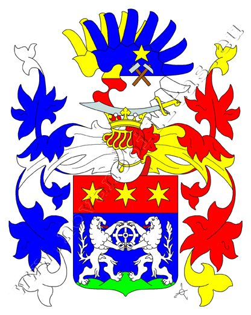
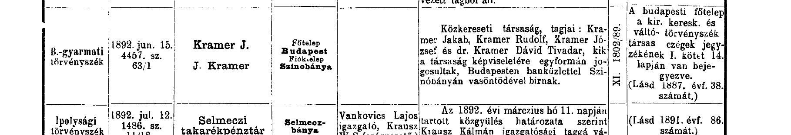
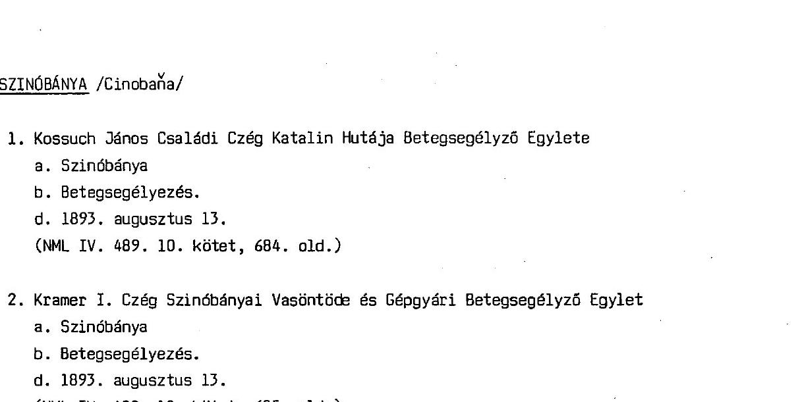
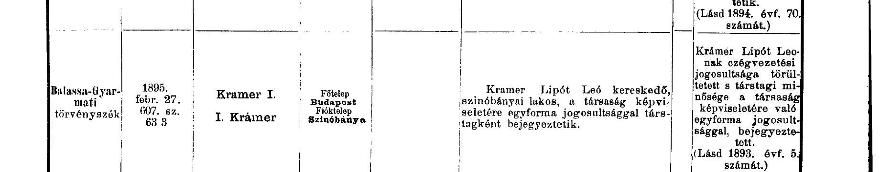
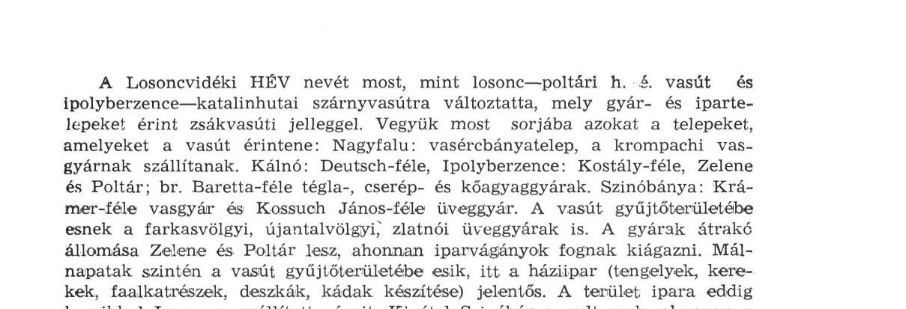
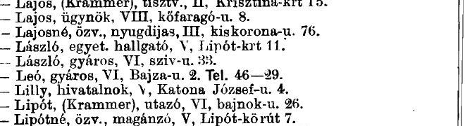
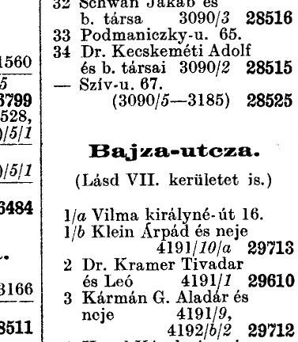

# Famille *szinóbányai Kramer* — homonymes non apparentés

**Statut** : cette famille **ne fait pas partie de notre arbre**. Les preuves primaires (faire-part d'Ignácz Kramer 1881, faire-part de Samu 1906, registre du commerce de la firme *Kramer J.*) établissent qu'elle forme une lignée distincte. Aucune filiation avec notre aïeul Zsigmond Kramer (Nyitra → Budapest, † 1928) n'est documentée.

Les szinóbányai Kramer sont **mentionnés anecdotiquement** dans le README principal car ils partageaient avec notre famille le patronyme et le quartier de résidence à Budapest (V. / VI. kerület) dans les années 1910-1940. Plusieurs indices initialement interprétés comme des liens de parenté (cohabitation à Bajza u. 2 notamment) se sont révélés être des erreurs de lecture OCR ou de simples proximités géographiques.

Ce fichier rassemble, à des fins de complétude et pour éviter la confusion future, la documentation amassée sur cette famille voisine.

**Pourquoi l'avoir conservée ?** Parce qu'une part significative du travail de recherche entrepris début 2026 portait sur cette lignée — sur l'hypothèse initiale (depuis corrigée) qu'elle pouvait être la nôtre. Le matériel constitue désormais une ressource de référence sur la bourgeoisie juive budapestoise de la fin du XIXᵉ et du premier XXᵉ siècle, utile comme contexte historique mais pas comme généalogie directe.

---

## 1. Anoblissement du 7 avril 1906

L'empereur François-Joseph Iᵉʳ élève les trois frères **Kramer Jakab, József et Rezső (Rudolf)**, copropriétaires de la maison de banque J. Kramer, à la noblesse hongroise. Diplômes individuels délivrés le 15 septembre 1906. Prédicat **« szinóbányai »** (référence à la fonderie familiale de Szinóbánya, comitat de Nógrád, aujourd'hui Cinobaňa en Slovaquie). Armoiries : deux lions d'argent sur champ d'azur tenant une roue dentée, sous un chef de gueules chargé de trois étoiles d'or. Source : Michal Fiala / Jan Županič, *Nová šlechta v českých zemích a podunajské monarchii* (Institut d'histoire, Académie des sciences de la République tchèque), fondée sur les Archives nationales de Prague et l'*Allgemeines Verwaltungsarchiv* de Vienne.

*Armoiries des frères Jakab, József et Rezső Kramer, anoblis le 7 avril 1906 avec le prédicat « szinóbányai ».*

| Source | URL | Archive locale |
|---|---|---|
| Nova Nobilitas (Fiala/Županič) | [fiche](https://www.novanobilitas.eu/rod/kramer-de-szinobanya) | [novanobilitas-Kramer_de_Szinobanya.md](../actes/archives-web/novanobilitas-Kramer_de_Szinobanya.md) |
| Blason 1906 | [image](https://www.novanobilitas.eu/sites/default/files/kramer_von_szinobanya_1906.jpg) | [kramer_von_szinobanya_1906_blason.jpg](../actes/archives-web/kramer_von_szinobanya_1906_blason.jpg) |
| Wikipédia HU — Szinóbánya | [article](https://hu.wikipedia.org/wiki/Szin%C3%B3b%C3%A1nya) | [wikipedia-hu-Szinobanya.md](../actes/archives-web/wikipedia-hu-Szinobanya.md) |
| Cinobaňa — história | [site officiel](https://www.cinobana.sk/historia.html) | [cinobana-historia.md](../actes/archives-web/cinobana-historia.md) |
| Geni (gestion W.-E. Eckstein) | [recherche](https://www.geni.com/search?search_type=people&q=Kramer+Szinobanya) | [geni-Kramer_de_Szinobanya.md](../actes/archives-web/geni-Kramer_de_Szinobanya.md) |

## 2. Structure familiale

### Génération –1 : Ignácz Kramer (≈1789 – 27 octobre 1881)

Père des anoblis. Décédé à **Budapest, Nagy Korona-utca 24**, 92 ans, inhumé au cimetière israélite (28.10.1881). Source primaire : faire-part mortuaire OSZK [gyászjelentés 203630](https://dspace.oszk.hu/handle/20.500.12346/203630) — fac-similé et OCR archivés dans [oszk-gyaszjelentesek/](../actes/archives-web/oszk-gyaszjelentesek/README.md). Le document liste exhaustivement ses **6 enfants** vivants au 27 octobre 1881, leurs conjoints et **tous ses petits-enfants nommés** (18 Kramer + 5 Weinberger + 1 Weisz), ainsi que 4 arrière-petits-enfants.

| Enfant d'Ignácz | Conjoint(e) | Anobli 1906 | Petits-enfants d'Ignácz listés en 1881 (descendance propre) |
|---|---|---|---|
| **Jakab** (1835–1919) | Hirsch Janka (1838–1916) | ✓ *szinóbányai* | **Tivadar**, Hugó, Róza, Leo, Mór, Oszkár, Jenny |
| **Rudolf / Rezső** | Hay Nina | ✓ *szinóbányai* | Ilona, Vilma, Margit, Jenő |
| **Samu** (≈1836–3.10.1906) | Lőwy Szidónia | ✗ (chevalier de l'Ordre de François-Joseph, *volt cs. és kir. udvari bútorgyáros* = ancien fabricant de meubles de la cour impériale et royale) | Henrik, Aranka |
| **József** | tószegi Freund Ida | ✓ *szinóbányai* | Felix, Adél, Ernő, Emil (+ Paula, Ignácz-Pál, Paulina nés ou à naître) |
| **Katalin** († avant 10.1906) | Weisz B. Antal | — | Weisz Malvina → Weisz Ernő, Arthur |
| **Cecília / Cäcilie** | Weinberger Jakab († avant 10.1906) | — | Weinberger Ádám, Jenny, Klára, Károly, Miksa |

### Génération 0 : confirmation du prédicat — faire-part de Samu, 3 octobre 1906

Samu Kramer meurt à Budapest (V., Sas-utca 17), 70 ans, 6 mois après l'anoblissement de ses trois frères. Source primaire : [OSZK 203680](https://dspace.oszk.hu/handle/20.500.12346/203680). Son faire-part identifie explicitement ses frères survivants avec le **prédicat anobli** :

> *« szinóbányai Kramer Jakab és neje szül. Hirsch Johanna, szinóbányai Kramer Rezső és neje szül. Hay Nina, szinóbányai Kramer József és neje szül. tószegi Freund Ida és özv. Weinberger Jakabné szül. Kramer Cecília mint testvérek »*

Cette attestation, datée de six mois après l'anoblissement, rend la filiation **incontestable** sur la génération 0.

### Descendance — génération +1 et au-delà

**Jakab × Johanna Janka Hirsch** (Johanna fille de Leopold Hirsch × Josefine Hirsch). 7+ enfants : **Dr. Theodor = Dávid Tivadar (né 1861)**, Jenny Eugenie (1860–1931, ⚭ Béla Singer), Rosalie (1866, ⚭ Emil Singer puis Johann Janesch), **Lipót / Leó (1869–1921, ⚭ Aranka)**, Moritz / Mór (1870, ⚭ Katalin), Hugo, Oszkár.

- **Dr. Tivadar — preuves primaires consolidées** (détail : [analyse_szinobanyai_kramer.md §3](analyse_szinobanyai_kramer.md#3-consolidation-du-lien-tivadar--famille-szinóbányai-preuves-primaires)) : (a) listé nommément parmi les petits-enfants d'Ignácz dans le faire-part 1881 ; (b) désigné *« dr szinóbányai gyáros »* dans les annuaires téléphoniques de Budapest 1914, 1917, 1929, 1942 ; (c) qualifié *« dr Szinóbányai Tivadar gyáros »* dans le rapport annuel 1916 du Tanárképző Gyakorló Főgimnázium, père du soldat tombé Miklós ; (d) enregistré comme associé fondateur de la succursale Szinóbánya de la firme *Kramer J.* en 1892 (*Központi Értesítő*) ; (e) copropriétaire de VI. Bajza u. 2 avec son frère Leó.
- **Enfants de Tivadar (Tanárképző 1916, fac-similé archivé)** : **Miklós** (Szinóbányai Kramer Miklós, né ~1893, études secondaires 1904-1912 au Tanárképző Gyakorló sous le prof. Pruzsinszky János dr, tombé au front russe le **1ᵉʳ septembre 1916** ; fondation commémorative de 1500 couronnes établie à son nom par **la famille Schmidl** — oncles Schmidl László et Dr Schmidl Miklós + tantes mariées Mme Dános Árpád, Mme Oppenheim Henrik, **Mme Marczali Henrik** (épouse de l'historien Dr Henrik Marczali, 1856-1940), Mme May Frigyes — ce qui suggère que **l'épouse de Tivadar est née Schmidl** ; piste à vérifier, cf. [analyse_szinobanyai_kramer.md §3bis](analyse_szinobanyai_kramer.md#3bis-épouse-de-tivadar--une-schmidl-hypothèse-documentée)) et **Ottilia** (*Szinóbányai Krámer Ottilia*). Fac-similés : [éloge Miklós pp. 64-66](../actes/archives-web/hungaricana/Budapest_B561_TanarkepzoGyakFogimn_B597_1916__pages64-66.pdf), [fondation Schmidl pp. 67-70](../actes/archives-web/hungaricana/Budapest_B561_TanarkepzoGyakFogimn_B597_1916__pages67-70.pdf).

**József × Ida Freund von Tószeg**. Enfants attestés : Paula (⚭ dr Milkó Endre, Szeged), Adél (⚭ dr Polgár Ármin), Felix, Ernő, Emil dr, + Paulina (= Paula ?) et Ignácz-Pál selon Geni. Faire-part de la petite-fille **Diniké Milkó** (Szeged, 12 sept. 1919, 12 ans) dans *Délmagyarország* — fac-similé archivé : [Delmagyarorszag_1919_09_13_pg64.jpg](../actes/archives-web/hungaricana/Delmagyarorszag_1919_09_13_pg64_faire-part_Dinike_Milko.jpg) — y figurent Félix, Ernő, Emil dr, Adél comme *« oncles et tantes »* et **« özv. szinóbányai Kramer Józsefné »** (veuve de József) comme *grand-mère*, ce qui établit que József est mort avant septembre 1919. **Emil dr** devient *m. kir. kormányfőtanácsos ügyvéd* (conseiller principal du gouvernement royal, avocat) en 1940-1943 (annuaires téléphoniques). Felix est associé banquier de la firme en 1924.

**Rezső × Nina Hay**. Fils Jenő (associé de la firme 1924), filles Ilóna, Vilma, Margit.

**Samu × Lőwy Szidónia** (non anoblis). Fils Henrik, fille Aranka, petits-enfants Mártha et Marianne.

**Cecília × Weinberger Jakab**. Enfants Ádám, Jenny, Klára, Károly, Miksa.

## 3. Firme *Kramer J.* — chronologie

**[✓ 1887]** Enregistrement initial de la firme au Tribunal de commerce et du change de Budapest (*kir. kereskedelmi és váltótörvényszék*), registre des sociétés, vol. I p. 14 (*Központi Értesítő* 1887, n° 38 — à consulter pour l'acte fondateur).

**[✓ 1892]** Enregistrement de la succursale **Szinóbánya** au Tribunal de Balassa-Gyarmat (*B.-gyarmati törvényszék*, 15 juin 1892, acte 4457. sz. 63/1). Société en nom collectif (*közkereseti társaság*) à quatre associés : **Kramer Jakab, Kramer Rudolf, Kramer József, dr. Kramer Dávid Tivadar** — « *kik a társaság képviseletére egyformán jogosultak, Budapesten bankűzlettel, Szinóbányán vasöntődével birnak* » (tous avec pouvoir égal de représentation ; à Budapest une **maison de banque**, à Szinóbánya une **fonderie de fer**) :

**[✓ 1893, 13 août]** Constitution de la caisse de secours ouvrière : *Kramer I. Czég Szinóbányai Vasöntöde és Gépgyári Betegsegélyző Egylet* (**Société d'assurance maladie des ouvriers de la fonderie de fer et de la fabrique de machines de la firme Kramer I., Szinóbánya**). Archive : **NML IV. 489. 10. kötet, 685. old.** (Nógrád Megyei Levéltár). La structure de Szinóbánya est donc **vasöntöde + gépgyár** (fonderie + construction mécanique) :

**[✓ 1895, 27 février]** Entrée d'un cinquième associé : **Krámer Lipót Leó, kereskedő, szinóbányai lakos** (commerçant, domicilié à Szinóbánya) — enregistré à Balassa-Gyarmat (607. sz. 63/3) comme associé de plein droit de représentation :

**[✓ 1924]** L'annuaire commercial *Magyarország kereskedelmi címtára* (p. 1388) liste la firme avec cinq associés — **K. József, dr. K. Dávid Tivadar, K. Lipót Leó, K. Félix, K. Jenő** — exerçant désormais comme **bankűzlet valamint gipszelárusitás — Bankgeschäft u. Gipsverschleiss** (maison de banque et négoce de gypse), siège **IV. Váci u. 36**, succursale **Szinóbánya** :

Entre 1895 et 1924, Jakab et Rudolf sortent du registre ; Félix et Jenő y entrent — vraisemblablement succession générationnelle (enfants ou neveux). L'activité de Szinóbánya a également évolué de la fonderie (1892-1893) au négoce de gypse (1924).

**[✓ confirmé]** Une étude d'histoire industrielle régionale (*Nógrád Megyei Múzeumi Évkönyv* 1979, p. 85) mentionne explicitement la **Krámer-féle vasgyár** (fonderie Krámer) parmi les établissements industriels desservis par la ligne du *Losoncvidéki HÉV* :

## 4. Kramer à Bajza u. 2 (1920-1928)

**[✓ 1922-1923]** L'annuaire d'adresses *Budapesti Czim- és Lakásjegyzék* (vol. 28, p. 1879) liste à la lettre K :
- **Krámer Leó, gyáros, VI. Bajza-u. 2. Tel. 46—29** (industriel)
- Krámer Félix, bankár, V. honvéd-u. 4 (associé banquier de la firme, domicile distinct)

**[✓ 1928 — propriété]** Le *Ház- és telekjegyzék* (registre foncier) du VI. arrondissement indique pour **Bajza-utcza n° 2** : propriétaires **Dr. Kramer Tivadar és Leó** (parcelle 4191/1, matricule 29610) — Tivadar et Leó **copropriétaires** de l'immeuble :

## 5. Engagement civique et activité industrielle

- **Fondation Jakab × Hirsch Janka**, acceptée par le conseil municipal de Budapest le 23 juin 1909 avec remerciements officiels ([BPSZKJ 1909](https://library.hungaricana.hu/en/view/BPSZKJ_1909/)).
- **Fondation Szinóbányai Kramer Miklós** (1500 couronnes) au Tanárképző Gyakorló Főgimnázium, 1916, en mémoire du soldat tombé.
- **Fonderie Szinóbánya** : catalogue illustré attesté en 1895 (production de cuisinières d'économie et fers à repasser). Emploie 300 ouvriers en 1930 (*Lapszemle* 1930-09-18). Activité documentée jusqu'en 1943 dans les annuaires de Budapest. Nationalisée 1948.
- **Alliance élite** : Leó szinóbányai épouse Aranka, fille de Fürst Bertalan (famille megyeri Krausz / domonyi Brüll), selon Vörös Károly, « Budapest legnagyobb adófizetői 1903-1917 » (*Tanulmányok Budapest Múltjából XVII*, 1966). Jakab szinóbányai figure dans le même volume parmi les grands contribuables de Budapest.

## 6. Sources Hungaricana archivées localement

| Collection | Référence | PDF local | Contexte |
|---|---|---|---|
| *Budapesti Czim- és Lakásjegyzék 1922-1923* (vol. 28) | [pg. 1878](https://library.hungaricana.hu/en/view/BPLAKCIMJEGYZEK_28_1922-1923/?pg=1878&layout=s), [pg. 1879](https://library.hungaricana.hu/en/view/BPLAKCIMJEGYZEK_28_1922-1923/?pg=1879&layout=s) | [1879](../actes/archives-web/hungaricana/BPLAKCIMJEGYZEK_28_1922-1923__pages1879-1879.pdf) | Entrées Kramer Leó / Dr Kramer Tivadar à Bajza u. 2 |
| *Budapesti Czim- és Lakásjegyzék 1928* (vol. 29) | [pg. 139](https://library.hungaricana.hu/en/view/BPLAKCIMJEGYZEK_29_1928/?pg=139&layout=s) | [140](../actes/archives-web/hungaricana/BPLAKCIMJEGYZEK_29_1928-1724633740__pages140-140.pdf) | **Tivadar + Leó copropriétaires de Bajza u. 2** |
| *Magyarország kereskedelmi címtára 1924* | [pg. 1388](https://library.hungaricana.hu/en/view/FszekCimNevTarak_27_024/?pg=1380) | [1381](../actes/archives-web/hungaricana/FszekCimNevTarak_27_024__pages1381-1381.pdf) | **Firme Kramer J. en 1924** — 5 associés, bankház + gipsz |
| *Magyarország kereskedelmi címtára 1942 / 1943* | [1942 pg. 517](https://library.hungaricana.hu/en/view/FszekCimNevTarak_20_019_04_00_1942/?pg=517&layout=s), [1943 pg. 570](https://library.hungaricana.hu/en/view/FszekCimNevTarak_20_019_04_00_1943_01/?pg=570&layout=s) | [1942 p. 518](../actes/archives-web/hungaricana/FszekCimNevTarak_20_019_04_00_1942__pages518-518.pdf) | Continuité de la firme Kramer J. jusqu'à la Seconde Guerre |
| *Központi Értesítő 1892* (vol. 2) | [pg. 972](https://library.hungaricana.hu/en/view/SZTNH_KozpontiErtesito_1892_2/?pg=972&layout=s) | [973](../actes/archives-web/hungaricana/SZTNH_KozpontiErtesito_1892_2-1612054939__pages973-973.pdf) | **Enregistrement fondateur succursale Szinóbánya** (Jakab, Rudolf, József, Tivadar) |
| *Központi Értesítő 1895* | [pg. 344](https://library.hungaricana.hu/en/view/SZTNH_KozpontiErtesito_1895/?pg=344&layout=s) | [345](../actes/archives-web/hungaricana/SZTNH_KozpontiErtesito_1895-1612054939__pages345-345.pdf) | **Entrée de Lipót Leó** comme associé |
| *Nógrád megyei múzeumi évkönyv 1979* | [pg. 86](https://library.hungaricana.hu/en/view/MEGY_NOGR_Muzevkonyv1979/?pg=86&layout=s) | [87](../actes/archives-web/hungaricana/MEGY_NOGR_Muzevkonyv1979__pages87-87.pdf) | **Krámer-féle vasgyár** à Szinóbánya |
| *NOGM_AFT_17* (Nógrád Megyei Múzeumok) | [pg. 114](https://library.hungaricana.hu/en/view/NOGM_AFT_17/?pg=114&layout=s) | [115](../actes/archives-web/hungaricana/NOGM_AFT_17__pages115-115.pdf) | **Caisse de secours ouvrière** (1893) |
| *Tanárképző Főgimnázium 1916* | pp. 64-66 + 67-70 | [éloge Miklós](../actes/archives-web/hungaricana/Budapest_B561_TanarkepzoGyakFogimn_B597_1916__pages64-66.pdf) + [fondation Schmidl](../actes/archives-web/hungaricana/Budapest_B561_TanarkepzoGyakFogimn_B597_1916__pages67-70.pdf) | **Miklós tombé au front russe 1.09.1916**, fondation par la famille Schmidl |
| *Délmagyarország* 1919-09-13 | p. 64 | [JPG 2 MB](../actes/archives-web/hungaricana/Delmagyarorszag_1919_09_13_pg64_faire-part_Dinike_Milko.jpg) + [PDF](../actes/archives-web/hungaricana/Delmagyarorszag_1919_09__pages64-64.pdf) | Faire-part Diniké Milkó, petite-fille de József |
| *Annuaire téléphonique 1920* | p. 302 | [324](../actes/archives-web/hungaricana/FszekCimNevTarak_20_00_1920__pages324-324.pdf) | Page K complète : Jakab IV Sütő 2, Leó, Tivadar, József Bajza 22, Henrik, Mór, Samu, Jenő |
| OSZK Gyászjelentések | Ignácz 1881 + Samu 1906 | [oszk-gyaszjelentesek/](../actes/archives-web/oszk-gyaszjelentesek/README.md) | Faire-part primaires de la famille |

## 7. Analyses complémentaires

- [analyse_szinobanyai_kramer.md](analyse_szinobanyai_kramer.md) — discussions, hypothèses méthodologiques, arbitrage « Ignácz = György ? », alliance Tivadar × Schmidl, homonymes Zsigmond
- [analyse_lien_zsigmond_szinobanyai.md](analyse_lien_zsigmond_szinobanyai.md) — démonstration détaillée que Zsigmond n'est pas szinóbányai
- [telechargements_manuels_hungaricana.md](telechargements_manuels_hungaricana.md) — catalogue des pièces à exporter manuellement
- Dépouillement Hungaricana (84 hits « Kramer szinóbányai ») : [actes/archives-web/hungaricana-szinobanyai-kramer.md](../actes/archives-web/hungaricana-szinobanyai-kramer.md)

## 8. Profils Geni

Profils gérés par :
- **Wolf-Erich Eckstein**, Institut für Jüdische Geschichte Österreichs — Jakab & Johanna Janka
- **Itai Hermelin** — Dr Theodor/Tivadar, Leó, Mór
- **Sándor Feldmájer** — Jenny Eugenie, Rosalie

Archive détaillée : [geni-Kramer_de_Szinobanya.md](../actes/archives-web/geni-Kramer_de_Szinobanya.md).
